# How to Use <!-- omit from toc -->

This guide shows the overall process of simulation creation.

Steps related to your role are shown and linked in the table below

# Team-relevant Sections <!-- omit from toc -->

| Role             | Relevant Topics |
| ---------------- | :-------------- |
| All | [Prerequisites](#1-prerequisites) \| [Cloning The Repository](#2-cloning-the-repository) \| [Switching to Another Branch](#4-switching-to-another-branch) \| [Pulling Changes](#6-pulling-changes) |
| Content Liaisons | [Creating a New Branch](#3-creating-a-new-branch) \| [Leaving Comments](#8-leaving-comments) \| [Pull Request Review \& Approval](#10-pull-request-review--approval) |
| Developers       | [File Structure](#5-file-structure) \| [Committing Changes](#7-committing-changes) |
| QA Testers       | [Leaving Comments](#8-leaving-comments) \| [Pull Requests](#9-pull-requests) \| [Pull Request Review \& Approval](#10-pull-request-review--approval) |
| Admins           | [Pull Request Review \& Approval](#10-pull-request-review--approval) |

# Table of Contents <!-- omit from toc -->

- [1. Prerequisites](#1-prerequisites)
- [2. Cloning The Repository](#2-cloning-the-repository)
- [3. Creating a New Branch](#3-creating-a-new-branch)
- [4. Switching to Another Branch](#4-switching-to-another-branch)
  - [4.1. VSCode](#41-vscode)
  - [4.2. Terminal](#42-terminal)
- [5. File Structure](#5-file-structure)
- [6. Pulling Changes](#6-pulling-changes)
  - [6.1. VSCode](#61-vscode)
  - [6.2. Terminal](#62-terminal)
- [7. Committing Changes](#7-committing-changes)
  - [7.1. General Information](#71-general-information)
  - [7.2. VSCode](#72-vscode)
  - [7.3. Terminal](#73-terminal)
- [8. Leaving Comments](#8-leaving-comments)
- [9. Pull Requests](#9-pull-requests)
- [10. Pull Request Review \& Approval](#10-pull-request-review--approval)
- [11. Delete This README if you haven't already](#11-delete-this-readme-if-you-havent-already)


# 1. Prerequisites

1. Have Git installed
   - Install Git from [this link](https://git-scm.com/install/)
   - Click through the install, **YOU DO NOT NEED TO CHANGE ANY OPTIONS**
   - Once installed, close any open terminals if you have any open
   - Reopen the terminal (CMD, Powershell, Git Bash, etc.) and run the following command

     ```
     git --version
     ```

     If this returns a version number, Congrats! You have successfully installed Git
     At the time of writing, the current windows git version is "2.54.0.windows.1"

     If there are errors, try running the installer again

- Run the following commands to configure Git with your Github information

  ```
  git config --global user.name "{Put Your Full Name Here}"
  ```

  //example: git config --global user.name "John Doe"

  ```
  git config --global user.email "{Put Your Email Here}"
  ```

  //example: git config --global user.email "johndoe@gmail.com"

2. Have VSCode installed (That is what this guide uses, feel free to use other editors)
   - Install VSCode from [this link](https://code.visualstudio.com/download)
   - Click through the install, **YOU DO NOT NEED TO CHANGE ANY OPTIONS**
   - Launch VSCode and sign into your Github account

# 2. Cloning The Repository

### NOTE: If you have already done this, SKIP TO THE NEXT STEP.<!-- omit from toc -->

1. Go to where you want to clone the repository, right click within the directory and select **"Open in Terminal"**

   //example: project folder in the Documents Folder

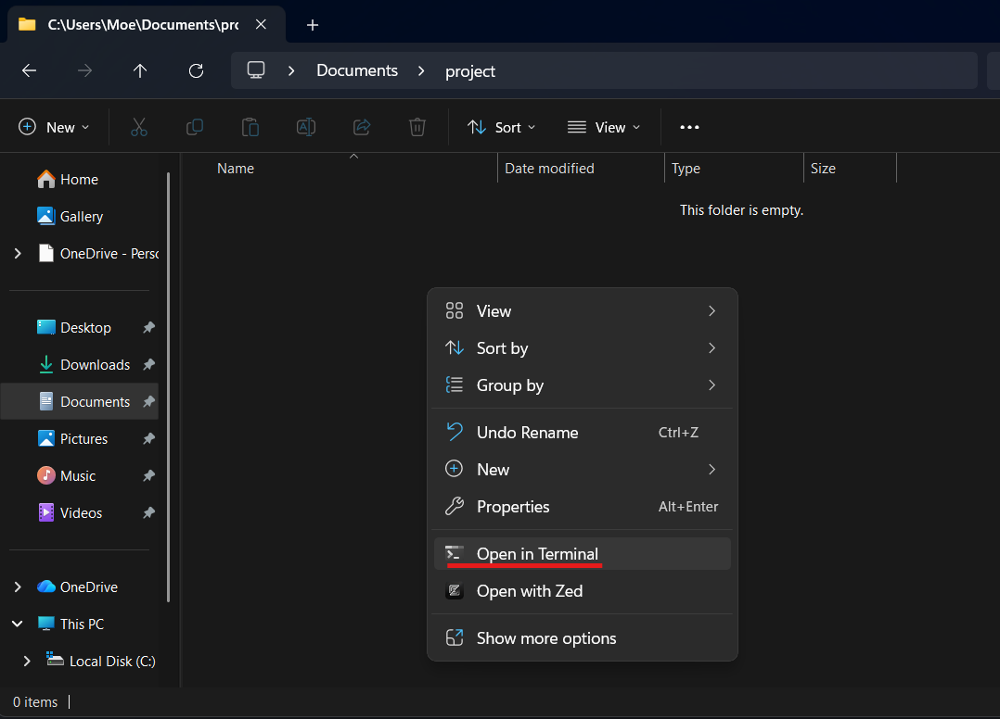

2. Within the terminal, type in

```
git clone --branch templates https://github.com/Tims-Sims/simulations.git
```

3. After cloning, move into the simulations directory

```
cd simulations
```

4. Open in VSCode

```
code .
```

# 3. Creating a New Branch

1. In the [simulations repository](https://github.com/Tims-Sims/simulations), click on **main** and in the drop down, select "View all branches" **OR** Go to [this link](https://github.com/Tims-Sims/simulations/branches)

   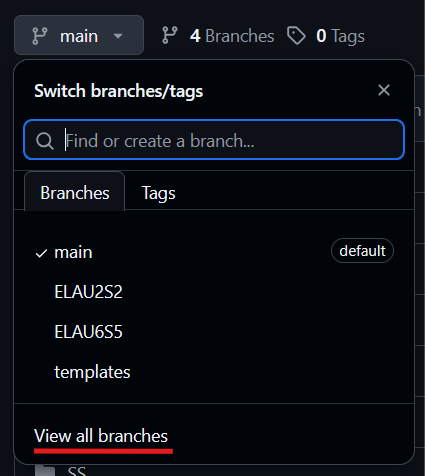

2. Click **"New Branch"**

3. Select the source as **templates**

4. Name the branch after the name of the simulation to be made, following the naming convention

   > ## Naming Convention
   >
   > ### Main Subjects
   > | Subject | Abbreviation |
   > |---------|--------------|
   > | English Language Arts| ELA |
   > | Mathematics| MATH |
   > | Integrated Science| SCI |
   > | Information Technology| IT |
   > | Social Sciences| SS |
   > | Spanish| SPAN |
   >
   > ### Integrated Science Subjects
   > | Subject | Abbreviation |
   > |---------|--------------|
   > | Fundamentals| FUND |
   > | Physics| PHYS |
   > | Chemistry| CHEM |
   > | Biology| BIO |
   >
   > ### Social Science Subjects
   > | Subject | Abbreviation |
   > |---------|--------------|
   > | Social Studies| SOC |
   > | Geography| GEO |
   > | History| HIST |
   >
   > {Subject}{Form}{Term}{Unit}{Section}
   >
   > //example: English, Form 1, Term 2, Unit 4, Section 5 === ELAF1T2U4S5
   >
   > ---
   > For subjects like Integrated Science and Social Science with sub-subjects there is an additional folder
   >
   > {Main Subject}{Subject}{Form}{Term}{Unit}{Section}
   >
   > //example: Social Science, History, Form 1, Term 2, Unit 4, Section 5 === SSHISTF1T2U4S5

5. Open an issue (Issues -> New Issue) and name it the same as the branch created

   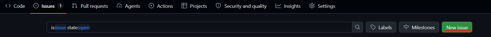

6. Set the issue label to **"dev needed"**

   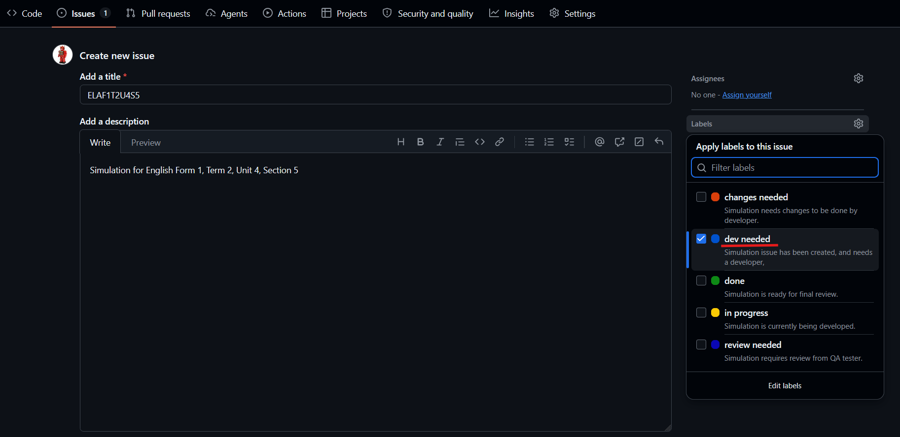

   Once created, set the Development branch as the branch created

   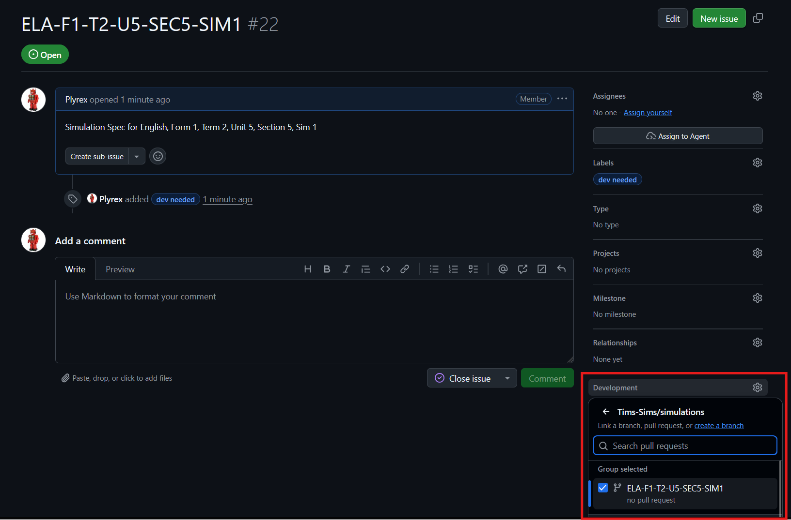

# 4. Switching to Another Branch

You can switch branches both within the terminal and on VSCode. We will go through how to do so on both.

## 4.1. VSCode

1. Click the "Synchronize" button on the bottom bar while the folder is open to update all branches

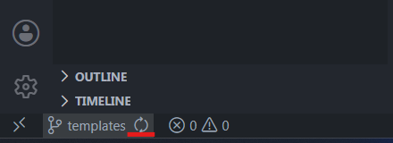

2. Click the button to the left of "Synchronize", search for the branch name and select it to switch branches

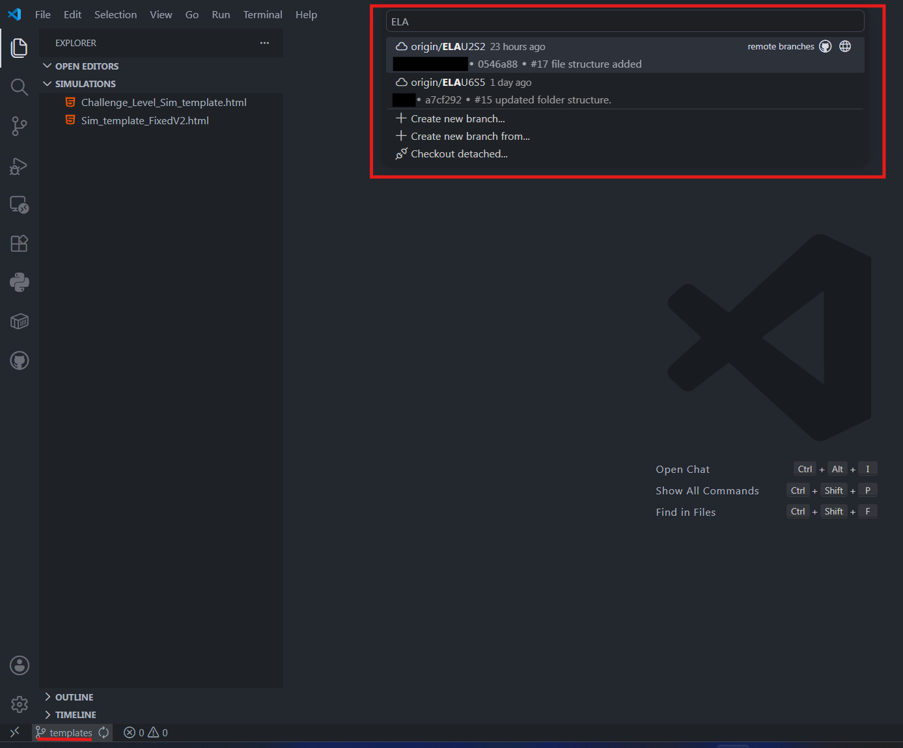

## 4.2. Terminal

1. The fetch command updates the available branches

```
git fetch
```

2. Now switch branches by using git switch

```
git switch {branch-name}
```

//example: git switch ELAF1T2U4S5

# 5. File Structure

**ENSURE FILE STRUCTURE IS PRESENT SO THAT THERE WILL BE NO MERGE CONFLICTS**

1. Select the template file you want to use and rename it
2. Delete the other template files
3. Create the file structure **BEFORE** beginning to work  
   > ### File Structure
   >
   > {Subject} -> {Form} -> {Term} -> {Unit} -> [Your HTML File Here]
   > As you can see, the naming convention follows the file structure
   >
   > //example: ELAF1T2U4S5 === ELA => Form1 => Term2 => Unit4 => ELAF1T2U4S5
   >
   > 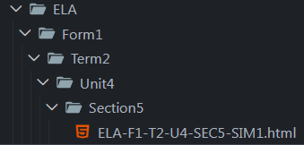
   >
   > //example: SSHISTF1T2U4S5 === SS => HIST => Form1 => Term2 => Unit4 => SSHISTF1T2U4S5
   >
   > 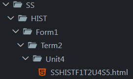
   
### NOTE: You should only have ONE HTML file that you are working on <!-- omit from toc -->


# 6. Pulling Changes

Changes made and pushed by others do not automatically show up, you must pull updates from the repository. This can be for many reasons such as a tester that is currently testing a branch while the developer is making changes

You can pull changes both within the terminal and on VSCode. We will go through how to do so on both

## 6.1. VSCode

1. Use the "Synchronize" button in VSCode

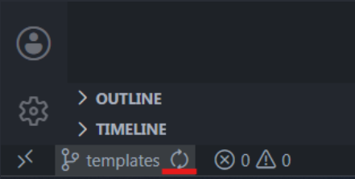

## 6.2. Terminal

1. Pull Changes using the following command

   ```
   git pull
   ```

# 7. Committing Changes

You can commit changes both within the terminal and on VSCode. We will go through how to do so on both.

## 7.1. General Information

1. When committing changes, ALWAYS start the commit messages with the issue number, this makes the commit show up within the issue thread.
   //example: #9999 fixed x, y and z

2. Go to the issue and set the label to **review needed**

3. Repeat steps as needed

## 7.2. VSCode

1. Once you have made changes, go to source control in VSCode to see all the files you have changed

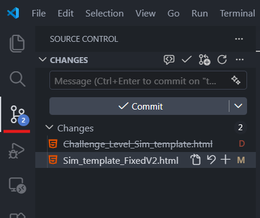

2. Stage your changes by clicking the **"+"** buttons, use the **"+"** next to "Changes" to stage all changes

   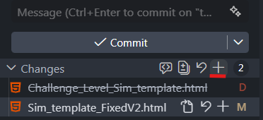

3. Type your commit message in the text box and click commit

   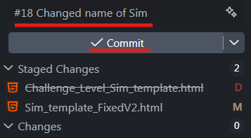

4. Once you have made a commit, you must push your changes by clicking
   "Sync Changes"

   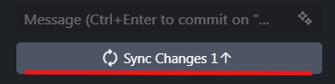

## 7.3. Terminal

1. Once you are within the code directory, stage your changes

```
git add {file1} {file2}
```

If you do not know what files can be staged, check with

```
git status
```

### OR <!-- omit from toc -->

stage everything using the command

```
git add .
```

2. Once you have staged, commit your changes

```
git commit -m "#{issue number} {comment}"
```

3. Finally, push your changes

```
git push
```

### NOTE <!-- omit from toc -->

If it is your first push on the branch, you should set the upstream with your first push using

```
git push origin {branch-name}
```

# 8. Leaving Comments

1. When you see an issue labelled **review needed**. Time to test

2. You can click on the commit made to see the differences in the code

   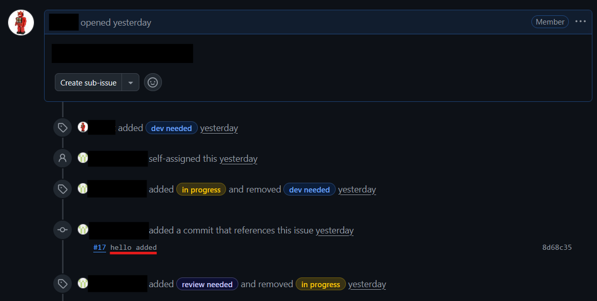

3. Copy the commit hash (the number next the the word Commit in the title) and view the changes in red and green (the Git Diff). Testers can also pull the changes and test that way.

   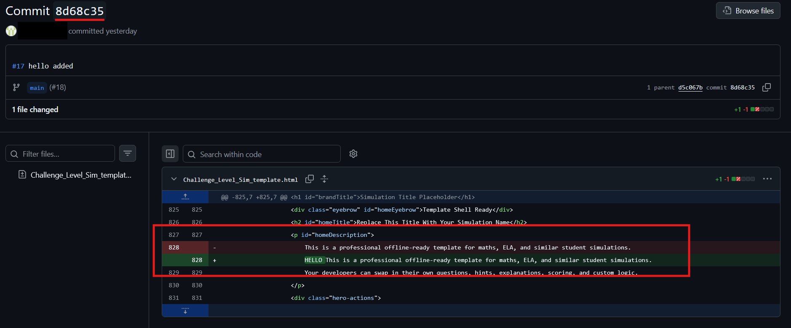

4. Leave a comment starting with the commit hash so that it links to the specific commit and change the label to **review needed**

   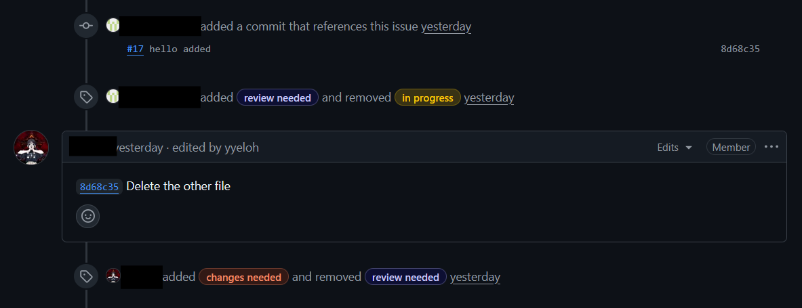

# 9. Pull Requests

1. Once a sim is labelled **done** in its specific issue thread, testers may open a pull request to merge into main

2. Go to **Pull Requests** and click **"Create Pull Request"**

   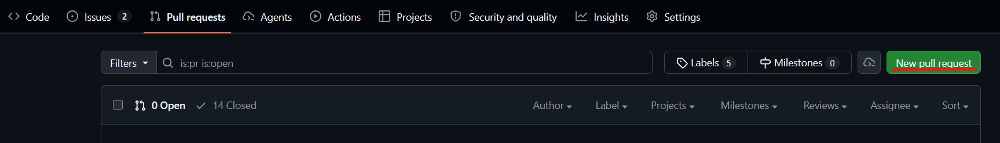

3. Set base as **main**

4. Set compare as the branch you want to merge

   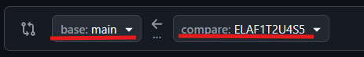

5. Create Pull Request and rename to ensure it is the same as the branch (PR names generate a bit weird so you 99% will have to change it)

# 10. Pull Request Review & Approval

1. The content liaison for the created sim subject and an admin tester would review the Pull Request one final time to ensure quality.

2. Each reviewer would submit a review where they can approve or note changes to be made.

3. If changes need to be made, once the developer makes them, it would show up on the Pull Request thread, allowing the reviewer to once again submit a review.

4. Once all reviewers have approved the Pull Request, an admin can finally merge the sim into the main branch.

# 11. Delete This README if you haven't already
